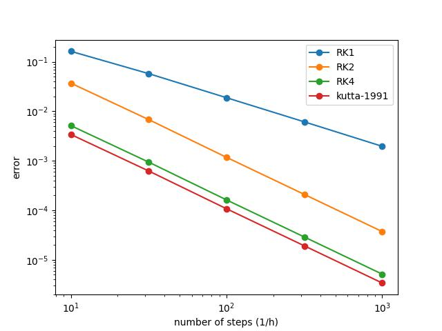

## motivation
I was skeptical about the RK4 theoretical result because
it felt wrong to me and i will explain why. and this motivates me to do some experiments with runge-kutta methods and measure the error.

## what is the runge-kutta

runge-kutta is a numerical method to solve differential equation of the following form:
```
dy/dx = f(x,t)
```
you can see some [video here](https://www.youtube.com/watch?v=HOWJp8NV5xU) on the problem.  
You can alternatively write the problem as the following:  
find an estimate for the following integral assuming the `h` as an small step
$$  y_{t+h} - y_t = \int_{t}^{t+h} f(y_{\tau},{\tau}).d{\tau} $$

I am not going to explain [the proof](https://www.youtube.com/watch?v=edHoOGN1pCA&list=PLHZhjPByiV3Jetjo2YO9TYml0duas9Pc9&index=22) but the following is one of the runge-kutta 4th order possible answers:
 </img>
and 


## the problem
the theory says with this formula the error would be at order of 4 so  
 $err = O(h^4)$  


this may looks normal and acceptable but lets simplify things a little bit and assume the function is not dependent to `x` and only keep the `t`.
note.  
> **side note:**  
If you need more intuition you can think of `y` as a sea with 2D surface and some flow in it and the integral would be the final movement of an floating object. removing `t` means the flow is equal everywhere but can still changes over time

with this assumption you can rewrite the RK4:
$$
 y_{t+h} = y_{t} + \frac{h}{6}\Big(f(t) + 4f(t+h/2) +  f(t+h)\Big) 
$$

and that is so grate to believe because you are just evaluating 3 points (instead of one point) and the error is not cutes to a third it dumped to power of four and this is awesome. (or i am getting something wrong)

so let the experiment begins

## experiment
I will use the integral of a circle and the final result should be the $\pi$ number so the the error can be measured easily.
$$
\frac{\pi}4 = \int_0^1 \sqrt{1-x^2}.d{x}
$$

#### result:



As you can see the slope of the RK2 and RK4 chats are equal
and it is accurately relates to $ O(h^{1.5}) $ to my interestingly it is not $ O(h^3) $ and i don't know why because the proof that linked above looks pretty straightforward.

if you know what's wrong here please post an issue